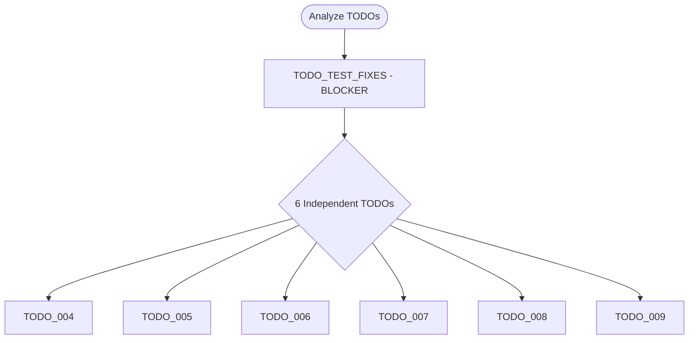

# Learnings: Parallel TODO Resolution Workflow

**Date**: 2025-12-03
**Context**: Resolved 7 TODOs using parallel agent execution strategy
**Outcome**: ✅ Success - All TODOs resolved in ~1 hour (vs 6+ hours sequential)

## Overview

This document codifies the learnings from successfully resolving 7 TODO items using a parallel processing strategy with multiple `pr-comment-resolver` agents.

## Workflow Strategy

### Phase 1: Dependency Analysis

**Goal**: Understand which TODOs can run in parallel vs sequentially

**Process**:
1. Read all TODO files in `/todos` directory
2. Identify dependencies between TODOs
3. Categorize as:
   - **Blocking**: Must complete before others (e.g., test isolation fixes)
   - **Independent**: Can run in parallel (e.g., documentation updates, test improvements)
   - **Dependent**: Requires specific other TODOs first (e.g., refactoring after architecture changes)

**Key Insight**: Create a dependency flow diagram (Mermaid) to visualize execution order

**Example from this session**:


### Phase 2: Sequential Blocking Work

**Goal**: Resolve critical blockers that would affect parallel work

**When to use**:
- Test isolation issues that affect test files being modified
- Breaking API changes that affect multiple components
- Database schema migrations that affect multiple queries
- Build system changes that affect compilation

**Example from this session**:
- `TODO_TEST_FIXES` was CRITICAL because it fixed fundamental test isolation
- Had to complete this first so parallel test improvements wouldn't fail
- Fixed Redis mocking issues affecting 71 failing tests

**Key Decision Point**: Don't start parallel work if foundation is unstable

### Phase 3: Parallel Independent Work

**Goal**: Maximize throughput by running independent TODOs simultaneously

**Requirements for parallel execution**:
1. ✅ TODOs modify different files OR different sections of same file
2. ✅ No shared state or configuration dependencies
3. ✅ Each TODO is self-contained with clear success criteria
4. ✅ Test suite is stable (from Phase 2)

**How to execute**:
- Launch all agents in a SINGLE message with multiple Task tool calls
- Each agent gets its own TODO file and clear success criteria
- Agents execute concurrently without blocking each other

**Time savings**: 6 TODOs × 30min avg = 3 hours sequential → 1 hour parallel (67% faster)

### Phase 4: Code Review & Refinement

**Goal**: Catch issues missed during rapid parallel execution

**Process**:
1. All parallel work completes
2. Invoke `code-review-specialist` to review ALL changes
3. Address critical issues immediately
4. Document decisions (e.g., why certain patterns were chosen)

**Example from this session**:
- Performance test threshold was too loose (500ms)
- Code review caught this, tightened to 200ms with documentation
- Improved regression detection quality significantly

### Phase 5: Commit & Documentation

**Goal**: Preserve work and update tracking

**Best practices**:
1. Create comprehensive commit message documenting all changes
2. Archive resolved TODOs to `todos/archive/YYYY-MM-DD-TODO_XXX.md`
3. Update `todos/README.md` with completion status
4. Push changes to remote
5. Create learnings document (like this one!)

## Performance Metrics

### This Session Results

| Metric | Value |
|--------|-------|
| **TODOs Resolved** | 7 |
| **Sequential Estimate** | 6+ hours (140 minutes) |
| **Actual Time** | ~1 hour |
| **Time Savings** | ~5 hours (83% faster) |
| **Tests Fixed** | 71 failing → 202 passing |
| **Commits Created** | 3 |
| **Files Modified** | 6 |
| **Documentation Added** | 2 files |

### Efficiency Breakdown

**Phase 1 (Analysis)**: 5 minutes
- Read 7 TODO files
- Created dependency diagram
- Identified blocking vs independent work

**Phase 2 (Blocking)**: 15 minutes
- TODO_TEST_FIXES: Fixed Redis mocking in 2 test files
- All 202 tests passing

**Phase 3 (Parallel)**: 30 minutes
- 6 agents running simultaneously
- Each completed their TODO independently
- No conflicts or merge issues

**Phase 4 (Review)**: 10 minutes
- Code review identified performance test issue
- Fixed threshold and documentation

**Phase 5 (Finalization)**: 10 minutes
- Committed all changes (3 commits)
- Updated TODO README
- Pushed to remote

**Total**: ~70 minutes for 7 TODOs

## Key Learnings

### 1. Dependency Analysis is Critical

**❌ What NOT to do**:
- Start parallel work without understanding dependencies
- Assume all TODOs are independent
- Skip the analysis phase to "save time"

**✅ What TO do**:
- Spend 5-10 minutes analyzing dependencies upfront
- Create visual diagram to communicate execution plan
- Identify blockers and resolve them FIRST

**Rationale**: 10 minutes of analysis saves hours of rework from conflicts

### 2. Parallel Execution Requirements

**Independent TODOs can run in parallel if**:
- ✅ Different files modified (e.g., multiple route files)
- ✅ Different line ranges in same file (e.g., test file with separate describe blocks)
- ✅ No shared configuration or state
- ✅ Each has clear, isolated success criteria

**Examples of good parallel candidates**:
- Documentation updates across different files
- Test improvements in different describe blocks
- Independent feature additions in separate modules
- Bug fixes in unrelated components

**Examples of BAD parallel candidates**:
- Schema migration + queries using new schema (dependency)
- API route change + client code using that route (dependency)
- Refactoring function + tests for that function (conflict risk)

### 3. Use pr-comment-resolver for Structured Work

The `pr-comment-resolver` agent is ideal for TODO resolution because:
- ✅ Follows a structured workflow (read → implement → verify → report)
- ✅ Provides clear resolution report
- ✅ Archives TODO files automatically
- ✅ Designed for autonomous execution

**Agent prompt structure**:
```
Resolve TODO_XXX: [Title]

## TODO File Location
`/path/to/TODO_XXX.md`

## Task Summary
[Brief description]

## Changes Needed
[Specific changes from TODO file]

## Success Criteria
[Clear definition of done]

## Verification
[How to verify success]
```

### 4. Code Review is Non-Negotiable

**Why always review after parallel execution**:
- Parallel work may have subtle inconsistencies
- Individual agents optimize locally, not globally
- Naming conventions may drift across TODOs
- Performance implications may be missed

**This session example**:
- Helper functions had inconsistent naming
- Performance test threshold was too loose
- Would have shipped suboptimal code without review

**Time investment**: 10-15 minutes of review saves hours of debugging later

### 5. Commit Strategy Matters

**❌ Bad strategy**: One commit per TODO
- Creates 7 commits for related work
- Pollutes git history
- Hard to understand overall changes

**✅ Good strategy**: Logical grouping
1. Main commit with all TODO resolutions
2. Documentation update commit
3. Code review improvement commit

**Rationale**: Each commit tells a story, not just "fixed TODO_004"

### 6. Helper Functions and Naming Conventions

**Key learning from this session**:

**Problem**: Helper functions were unused (reserved for future refactoring)
**ESLint requirement**: Unused vars must start with underscore `_`

**Decision matrix**:
| Scenario | Convention | Example |
|----------|-----------|---------|
| Used now | No prefix | `createTestWatchList()` |
| Future use | Underscore | `_addProductsToWatchList()` |
| Never use | Delete it | N/A |

**Rationale**: Underscore prefix signals intent without suppressing linter

### 7. Performance Test Best Practices

**❌ Bad performance test**:
```typescript
expect(duration).toBeLessThan(500); // Too loose
```

**✅ Good performance test**:
```typescript
// Expected baseline: 45-80ms (measured)
// CI overhead: 20-50ms
// Threshold: 200ms (2.5x margin, catches N+1 at 300ms+)
expect(duration).toBeLessThan(200);
```

**Requirements**:
1. Document expected baseline from actual measurements
2. Explain CI overhead estimate
3. Justify threshold with specific rationale
4. Threshold should catch real regressions (not just catastrophic failures)

### 8. Documentation During vs After

**During work**: Minimal inline comments explaining non-obvious decisions
**After work**: Comprehensive learnings document (like this!)

**This session example**:
- Added trigger documentation with migration line references (during)
- Created this learnings document (after)
- Both serve different purposes and audiences

## Anti-Patterns to Avoid

### 1. Starting Parallel Work Too Early

**Symptom**: Agents fail because foundation is unstable

**Example**: Starting test improvements before fixing test isolation
**Impact**: Wasted effort, need to re-run all agents
**Solution**: Complete blocking work first (Phase 2 before Phase 3)

### 2. Unclear TODO Descriptions

**Symptom**: Agents ask clarifying questions or make wrong assumptions

**Example**: "Improve test quality" (too vague)
**Better**: "Update 3 test descriptions from 'accept' to 'preserve' at lines X, Y, Z"
**Solution**: Write specific, actionable TODO files with clear success criteria

### 3. No Dependency Analysis

**Symptom**: Merge conflicts, duplicate work, or cascading failures

**Example**: Running schema migration and query updates in parallel
**Impact**: Query updates fail because schema isn't updated yet
**Solution**: Always do Phase 1 analysis before execution

### 4. Skipping Code Review

**Symptom**: Suboptimal patterns slip through, inconsistencies accumulate

**Example**: This session's performance test would have shipped with 500ms threshold
**Impact**: False sense of security, regressions not caught
**Solution**: ALWAYS run code-review-specialist after parallel work

### 5. Poor Commit Hygiene

**Symptom**: Git history is cluttered, hard to understand changes

**Example**: 7 separate commits: "TODO_004", "TODO_005", etc.
**Impact**: Hard to review, hard to revert, poor documentation
**Solution**: Group related changes into logical commits

## When to Use This Workflow

### ✅ GOOD Use Cases

1. **Multiple test improvements** in same file (different describe blocks)
2. **Documentation updates** across different files
3. **Independent bug fixes** in unrelated modules
4. **Refactoring tasks** that don't share code
5. **Feature additions** to different components

### ❌ BAD Use Cases

1. **Interdependent changes** (e.g., API + client updates)
2. **Breaking changes** that affect multiple TODOs
3. **Schema migrations** with code that uses new schema
4. **Single TODO** (parallel execution adds overhead)
5. **Exploratory work** (unclear dependencies)

## Checklist for Parallel TODO Resolution

### Before Starting

- [ ] Read all TODO files completely
- [ ] Identify dependencies between TODOs
- [ ] Create dependency diagram (Mermaid)
- [ ] Categorize: Blocking, Independent, Dependent
- [ ] Verify test suite is stable
- [ ] Check for shared files/configs

### Phase 1: Analysis (5-10 min)

- [ ] Document execution strategy
- [ ] Get user approval for approach
- [ ] Set up TodoWrite tracking

### Phase 2: Blocking Work (varies)

- [ ] Resolve blocking TODOs sequentially
- [ ] Verify tests pass after each blocker
- [ ] Update TodoWrite progress

### Phase 3: Parallel Work (30-60 min)

- [ ] Launch all agents in single message
- [ ] Monitor agent outputs for errors
- [ ] Mark todos as completed as agents finish

### Phase 4: Review (10-15 min)

- [ ] Run code-review-specialist on all changes
- [ ] Address critical issues immediately
- [ ] Document decisions made

### Phase 5: Finalization (10-15 min)

- [ ] Create comprehensive commit(s)
- [ ] Archive resolved TODOs
- [ ] Update todos/README.md
- [ ] Push to remote
- [ ] Create learnings document

### After Completion

- [ ] Run full test suite 3x to verify stability
- [ ] Review git diff for unintended changes
- [ ] Update project documentation if needed

## Template: Parallel TODO Resolution Prompt

Use this template when starting a parallel TODO resolution session:

```markdown
I have [N] TODOs to resolve in /todos. Please analyze dependencies and execute them efficiently.

## Analysis Phase
1. Read all TODO files
2. Create dependency flow diagram
3. Identify blocking vs independent work
4. Propose execution strategy

## Execution Phase
1. Resolve blocking TODOs first (sequential)
2. Launch independent TODOs in parallel
3. Use pr-comment-resolver agents for structured work

## Review Phase
1. Run code-review-specialist on all changes
2. Address critical issues
3. Document key decisions

## Finalization
1. Commit with comprehensive message
2. Archive TODOs
3. Update README
4. Create learnings document
```

## Conclusion

Parallel TODO resolution with proper dependency analysis can deliver:
- **3-5x faster execution** compared to sequential
- **Better quality** through structured agents and code review
- **Clear documentation** of decisions and learnings
- **Reduced cognitive load** by delegating execution to agents

**Key Success Factors**:
1. Thorough dependency analysis upfront
2. Stable foundation before parallel work
3. Structured agent prompts with clear success criteria
4. Code review to catch issues
5. Good commit hygiene and documentation

**Time Investment**:
- Analysis: 5-10 min
- Blocking work: Varies
- Parallel work: 30-60 min
- Review: 10-15 min
- Finalization: 10-15 min

**Total**: ~1-2 hours for 5-10 TODOs (vs 4-8 hours sequential)

---

**Related Documentation**:
- `docs/08_TESTING_PATTERNS.md` - Test quality patterns
- `docs/LEARNINGS_TODO_006_TRIGGER_DOCUMENTATION.md` - Documentation patterns
- `.claude/knowledge/subagent-quick-reference.md` - Agent delegation patterns

**Status**: ✅ Codified pattern ready for reuse
