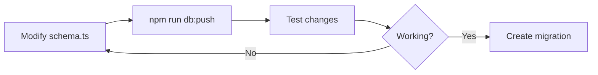
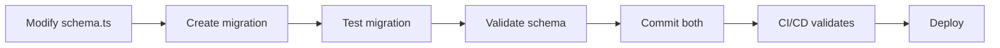

# Schema-Migration Quick Reference Card

**⚡ Fast reference for database migrations - keep this handy!**

---

## 🚨 Critical Rules

1. **NEVER commit `schema.ts` changes without a migration** (production)
2. **ALWAYS validate before committing**: `npm run validate:schema`
3. **ALWAYS pair schema + migration** - both or neither
4. **Development ONLY**: Use `db:push` for rapid iteration (don't commit)
5. **Production**: Create migration, test it, commit both files

---

## ⚡ Quick Commands

### Before Creating Migration

```bash
# Validate current state
npm run validate:schema

# Check if table exists
grep -r "CREATE TABLE.*your_table" migrations/

# Audit specific table
npm run audit:columns your_table_name
```

### Creating Migration

```bash
# 1. Find next migration number
ls migrations/*.sql | tail -1

# 2. Create migration file
# Format: migrations/XXXX_description.sql

# 3. Write migration SQL (see templates below)

# 4. Update shared/schema.ts to match

# 5. Test migration
npm run migrate

# 6. Validate schema
npm run validate:schema

# 7. Commit both files
git add shared/schema.ts migrations/XXXX_*.sql
git commit -m "feat: add your_feature"
```

### Troubleshooting

```bash
# Schema validation failed
npm run validate:schema  # See which tables are missing

# Column mismatch
npm run audit:columns table_name  # See actual DB columns

# Ghost table (in DB but not schema)
# → Add to shared/schema.ts OR create rollback migration

# Missing table (in schema but not DB)
# → Create migration OR run existing migrations
```

---

## 📋 Migration Templates

### Template 1: New Table

```sql
-- Migration: Add your_feature
-- Date: 2025-XX-XX
-- Description: Brief description

CREATE TABLE IF NOT EXISTS your_table (
    id SERIAL PRIMARY KEY,
    user_id INTEGER NOT NULL REFERENCES users(id) ON DELETE CASCADE,
    name VARCHAR(255) NOT NULL,
    description TEXT,
    is_active BOOLEAN DEFAULT TRUE,
    created_at TIMESTAMP DEFAULT NOW(),
    updated_at TIMESTAMP DEFAULT NOW()
);

-- Indexes
CREATE INDEX IF NOT EXISTS your_table_user_id_idx ON your_table(user_id);

-- Comments
COMMENT ON TABLE your_table IS 'Brief description';
```

**Schema (shared/schema.ts):**

```typescript
export const yourTable = pgTable(
  'your_table',
  {
    id: serial('id').primaryKey(),
    userId: integer('user_id')
      .references(() => users.id, { onDelete: 'cascade' })
      .notNull(),
    name: varchar('name', { length: 255 }).notNull(),
    description: text('description'),
    isActive: boolean('is_active').default(true),
    createdAt: timestamp('created_at').defaultNow(),
    updatedAt: timestamp('updated_at').defaultNow(),
  },
  (table) => ({
    userIdIdx: index('your_table_user_id_idx').on(table.userId),
  })
);
```

### Template 2: Add Column

```sql
-- Add column to existing table
ALTER TABLE existing_table
  ADD COLUMN IF NOT EXISTS new_column VARCHAR(100);

-- Add index for new column (if needed)
CREATE INDEX IF NOT EXISTS idx_existing_table_new_column
  ON existing_table(new_column);
```

**Schema update:**

```typescript
export const existingTable = pgTable(
  'existing_table',
  {
    // ... existing columns ...
    newColumn: varchar('new_column', { length: 100 }), // ADD THIS
  },
  (table) => ({
    // ... existing indexes ...
    newColumnIdx: index('idx_existing_table_new_column').on(table.newColumn), // ADD THIS
  })
);
```

---

## ✅ Pre-Commit Checklist

**Before committing schema changes:**

- [ ] Migration file created (`migrations/XXXX_*.sql`)
- [ ] Schema updated (`shared/schema.ts`)
- [ ] Table/column names match (camelCase → snake_case)
- [ ] Data types match (VARCHAR(255) → varchar({ length: 255 }))
- [ ] Foreign keys have CASCADE rules
- [ ] Indexes match between migration and schema
- [ ] Migration tested: `npm run migrate`
- [ ] Schema validated: `npm run validate:schema`
- [ ] Integration tests pass: `npm test`
- [ ] Column audit clean: `npm run audit:columns table_name`

---

## 🔍 Validation Commands

| Command | Purpose | When to Use |
|---------|---------|-------------|
| `npm run validate:schema` | Compare schema vs DB | Before every commit |
| `npm run audit:columns <table>` | Inspect table columns | Debugging mismatches |
| `npm run audit:monthly` | Full schema audit | Monthly maintenance |
| `npm run migrate` | Run pending migrations | After creating migration |
| `npm test` | Run integration tests | Before committing |

---

## 🚫 Common Mistakes

### Mistake 1: Ghost Table

**Problem:** Created table in migration but not in schema

```bash
# Symptom
npm run validate:schema
# ❌ GHOST TABLES FOUND: your_table
```

**Fix:**
1. Add table definition to `shared/schema.ts`, OR
2. Create rollback migration to remove table

### Mistake 2: Missing Migration

**Problem:** Added table to schema but no migration

```bash
# Symptom
npm run validate:schema
# ❌ MISSING TABLES FOUND: your_table
```

**Fix:**
1. Create migration with `CREATE TABLE`, OR
2. Run existing migrations: `npm run migrate`

### Mistake 3: Column Name Mismatch

**Problem:** Schema uses camelCase but migration uses wrong snake_case

```typescript
// ❌ WRONG
userId: integer('userid')  // Missing underscore

// ✅ CORRECT
userId: integer('user_id')  // Matches DB column
```

**Fix:** Use correct snake_case in schema definition

### Mistake 4: Missing CASCADE

**Problem:** Foreign key without `onDelete` cascade rule

```typescript
// ❌ WRONG
userId: integer('user_id').references(() => users.id)

// ✅ CORRECT
userId: integer('user_id')
  .references(() => users.id, { onDelete: 'cascade' })
```

**Fix:** Add `{ onDelete: 'cascade' }` to all foreign keys

---

## 🔄 Development Workflow

### Development (Local Iteration)



**Commands:**
```bash
# Rapid iteration (dev only)
vim shared/schema.ts
npm run db:push
npm run dev  # Test changes

# When stable, create migration
vim migrations/XXXX_feature.sql
npm run migrate
npm run validate:schema
git add shared/schema.ts migrations/XXXX_*.sql
git commit
```

### Production Deploy



**Commands:**
```bash
# Production-safe workflow
vim shared/schema.ts
vim migrations/XXXX_feature.sql
npm run migrate
npm run validate:schema
npm test
git add shared/schema.ts migrations/XXXX_*.sql
git commit -m "feat: add feature"
git push  # CI/CD runs validation
```

---

## 📚 Where to Learn More

- **Full Guide:** `docs/LEARNINGS_SCHEMA_MIGRATION_MISMATCH_PREVENTION.md`
- **Database Patterns:** `docs/02_DATABASE_PATTERNS.md` (Section 8)
- **Foreign Keys:** `docs/02_DATABASE_PATTERNS.md` (Section 5.1)
- **Rollback Guide:** `migrations/ROLLBACK_GUIDE.md`
- **CI/CD Checks:** `.github/workflows/migration-test.yml`

---

**Last Updated:** 2025-12-23
**Maintained By:** Development Team
