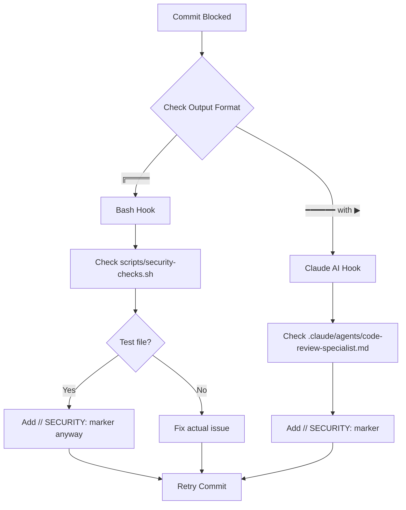

# Pre-Commit Hook Patterns and Solutions

**Created:** 2025-12-03
**Last Updated:** 2026-01-26
**Context:** Learned while committing batch insert optimization (TODO #010)
**Related:** `.git/hooks/pre-commit`, `.claude/hooks.json`, `docs/04_SECURITY_PATTERNS.md`

## Overview

The pre-commit hook enforces code quality and security standards by scanning staged changes for common anti-patterns. This document codifies how to work **with** the hook rather than fighting it.

**CRITICAL UPDATE (2026-01-26):** This project has **TWO independent pre-commit systems** that both must pass. Understanding which system is blocking your commit is essential for debugging.

## Dual Pre-Commit System Architecture

### Pattern: Two Independent Pre-Commit Enforcement Layers

**Context:** When commits are blocked but direct script execution passes (e.g., `npm run security:check` succeeds but commit fails), you're likely hitting the second enforcement layer.

**Problem:** Developers may not realize there are TWO separate systems checking their code, leading to confusion when one passes but the commit still fails.

**Architecture:**

#### 1. Husky Bash Hook (`.husky/pre-commit`)

**Location:** `.husky/pre-commit`
**Trigger:** Every `git commit`
**Execution:** Shell scripts via npm scripts

**Output Format:**
```bash
╔════════════════════════════════════════════════════════════════╗
║                    TYPE CHECKING                               ║
╚════════════════════════════════════════════════════════════════╝
```

**Scripts Run:**
- `npm run type-check` - TypeScript compiler errors
- `npx lint-staged` - ESLint + Prettier on staged files
- `npm run security:check` - Bash security scanner

**Security Detection:** `scripts/security-checks.sh`
```bash
# Line 253-277: passwordHash detection
PW_EXPOSURE=$(grep -rn "passwordHash:" server/ --include="*.ts" 2>/dev/null | \
  grep -v "SECURITY:" | \
  grep -v "// " | \
  grep -v "__tests__" | \
  grep -v "\.test\." | \      # ← EXCLUDES test files
  grep -v "interface " | \
  grep -v "type " | \
  grep -v ": string" | \
  grep -v "scripts/" || true)
```

**Key Feature:** Test files (`.test.ts`) are EXCLUDED from passwordHash detection.

#### 2. Claude Code AI Hook (`.claude/hooks.json`)

**Location:** `.claude/hooks.json`
**Trigger:** Every `git commit` (via Claude Code CLI integration)
**Execution:** AI agent `code-review-specialist`

**Output Format:**
```bash
━━━━━━━━━━━━━━━━━━━━━━━━━━━━━━━━━━━━━━━━
▶ Check name
━━━━━━━━━━━━━━━━━━━━━━━━━━━━━━━━━━━━━━━━
```

**Agent:** `.claude/agents/code-review-specialist.md`
**Detection Logic:** AI-powered pattern recognition (lines 2981+)

**Security Detection:**
```markdown
**BLOCKERS (11 total) - Commit fails:**
1. TypeScript errors
2. ESLint errors
3. passwordHash exposure
```

**Key Feature:** Does NOT exclude test files - applies SAME standards to ALL TypeScript files.

### Diagnostic Pattern: Output Format Identification

When a commit is blocked, check the terminal output format:

| Output Format | System | Action |
|---------------|--------|--------|
| `╔════` box borders | Bash (`scripts/security-checks.sh`) | Check bash script logic, add `// SECURITY:` markers |
| `━━━━━━` with `▶` bullets | Claude Code AI (`code-review-specialist`) | Add `// SECURITY:` markers (test files included) |

**Example Debug Session:**

```bash
$ git commit -m "fix: update test fixtures"

# Output shows:
━━━━━━━━━━━━━━━━━━━━━━━━━━━━━━━━━━━━━━━━
▶ Security Check: passwordHash exposure
━━━━━━━━━━━━━━━━━━━━━━━━━━━━━━━━━━━━━━━━

# Diagnosis: Claude Code AI agent is blocking
# Solution: Add // SECURITY: marker even in test files
```

### Detection Logic Comparison

| Aspect | Bash Hook | Claude Code AI |
|--------|-----------|----------------|
| **Test File Exclusion** | YES (`.test.` excluded) | NO (all files checked) |
| **passwordHash Detection** | Line-by-line grep | Pattern recognition + context |
| **Bypass Marker** | `// SECURITY:` inline comment | `// SECURITY:` inline comment |
| **Execution** | Shell script | AI agent via Claude CLI |
| **Configuration** | `.husky/pre-commit` + `scripts/security-checks.sh` | `.claude/hooks.json` + `.claude/agents/code-review-specialist.md` |

### Rationale

**Why Two Systems?**

1. **Defense in Depth:** Bash catches obvious patterns, AI catches complex/contextual issues
2. **Complementary Coverage:** Bash is fast/deterministic, AI understands intent
3. **Migration Safety:** Bash hook existed first, AI layer added later for enhanced detection
4. **Different Strengths:**
   - Bash: Fast, predictable, easy to bypass for exceptions (test file exclusions)
   - AI: Context-aware, catches subtle issues, harder to game

**Consequence:** Both systems must pass for commit to succeed. A fix that passes Bash may still fail AI review.

### Debugging Workflow

When commit is blocked:



**Steps:**

1. **Identify blocker** via output format (box vs bullets)
2. **Check which system** reported the issue
3. **Apply appropriate fix:**
   - **Bash hook:** May pass for test files, but AI won't
   - **AI hook:** Requires `// SECURITY:` marker in ALL files (including tests)
4. **Retry commit** - both systems must pass

**Related Patterns:**
- [Security Comment Patterns](#security-comment-patterns) - How to properly mark test fixtures
- [Pre-Commit Hook Warning vs Blocker Classification](#pre-commit-hook-warning-vs-blocker-classification) - What blocks commits

*Source: Debugging session 2026-01-26 (test fixture passwordHash blocking)*
*Added: 2026-01-26*

---

## Security Comment Patterns

### Pattern: Inline Security Markers (Works for BOTH Hook Systems)

**Context:** Both the Bash hook and Claude Code AI hook detect security-sensitive code (like `passwordHash`), but **only recognize exceptions when the marker is on the same line**.

**Critical:** This pattern works for BOTH enforcement systems. Always use inline `// SECURITY:` comments, even in test files.

**Established Marker Styles in Codebase:**
- `// SECURITY: Test data only`
- `// SECURITY: Test data - intentional use for database record`
- `// SECURITY: Test fixture - intentional for user creation`
- `// SECURITY: Test fixture credentials, not real secrets`

#### ❌ WRONG - Separate Line Comment (Blocked by Hook)

```typescript
// SECURITY: passwordHash in test data only, never exposed in queries
await db.insert(users).values({
  username: 'testuser',
  email: 'test@example.com',
  passwordHash: 'hash',  // ❌ Hook triggers - no marker on this line
  role: 'user',
});
```

**Why it fails:** The hook uses `grep -E "^\+" | grep -i "passwordHash" | grep -v "SECURITY:"` which checks each added line independently. The comment on line N doesn't protect line N+3.

#### ✅ CORRECT - Inline Comment (Passes Hook)

```typescript
await db.insert(users).values({
  username: 'testuser',
  email: 'test@example.com',
  passwordHash: 'hash', // SECURITY: Test data only, never exposed in queries
  role: 'user',
});
```

**Why it works:** The `SECURITY:` marker appears on the same line as `passwordHash`, so `grep -v "SECURITY:"` filters it out.

### Pattern: Multiple Security Markers

The hook recognizes these markers (case-insensitive):

1. **`SECURITY:`** - General security marker
2. **`NEVER`** - Absolute prohibition marker (e.g., "// NEVER expose passwordHash")
3. **`//`** - Comment indicator (filters out documentation)

**Hook Detection Logic:**
```bash
# From .git/hooks/pre-commit line 214
if echo "$CODE_DIFF_OUTPUT" | grep -E "^\+" | grep -i "passwordHash" | grep -v "NEVER" | grep -v "SECURITY:" | grep -v "//" >/dev/null 2>&1; then
  # Trigger blocker
fi
```

#### Example: All Valid Marker Styles

```typescript
// Test fixture setup
const testUser = {
  email: 'test@example.com',
  passwordHash: 'hash123', // SECURITY: Test fixture only
};

// Never expose in production queries
const sensitiveFields = {
  passwordHash: users.passwordHash, // NEVER expose - documentation example only
};

/**
 * User schema
 * @property {string} passwordHash - SECURITY: Hashed password, never exposed in API responses
 */
```

## Common Pre-Commit Hook Failures

### 1. Unused Variables (ESLint)

#### ❌ WRONG - Variable Declared but Never Used

```typescript
describe('Test Suite', () => {
  let testUser: typeof users.$inferSelect;  // ❌ Declared but never referenced
  let testRetailer: typeof retailers.$inferSelect;

  beforeEach(async () => {
    [testUser] = await db.insert(users).values({...}).returning();
    [testRetailer] = await db.insert(retailers).values({...}).returning();
  });

  it('should test something', async () => {
    // Only uses testRetailer, not testUser
    expect(testRetailer.name).toBe('Test Retailer');
  });
});
```

**Error:**
```
41:7  error  'testUser' is assigned a value but never used.
             Allowed unused vars must match /^_/u
             @typescript-eslint/no-unused-vars
```

#### ✅ CORRECT - Solution 1: Remove Unused Variable

```typescript
describe('Test Suite', () => {
  let testRetailer: typeof retailers.$inferSelect;

  beforeEach(async () => {
    // Create user but don't store reference (not needed)
    await db.insert(users).values({
      username: 'testuser',
      email: 'test@example.com',
      passwordHash: 'hash', // SECURITY: Test data only
      role: 'user',
    });

    [testRetailer] = await db.insert(retailers).values({...}).returning();
  });
});
```

#### ✅ CORRECT - Solution 2: Prefix with Underscore (Intentionally Unused)

```typescript
describe('Test Suite', () => {
  let _testUser: typeof users.$inferSelect;  // Prefix signals "intentionally unused"
  let testRetailer: typeof retailers.$inferSelect;

  beforeEach(async () => {
    // Stored for potential future use or debugging
    [_testUser] = await db.insert(users).values({...}).returning();
    [testRetailer] = await db.insert(retailers).values({...}).returning();
  });
});
```

**ESLint Rule:** `@typescript-eslint/no-unused-vars` with pattern `/^_/u` - variables starting with `_` are allowed to be unused.

### 2. passwordHash in Test Fixtures

**Context:** Test files need to create user records with password hashes for authentication testing.

#### ❌ WRONG - No Security Marker

```typescript
beforeEach(async () => {
  await db.insert(users).values({
    email: 'test@example.com',
    passwordHash: 'test_hash',  // ❌ Hook blocks this
  });
});
```

#### ✅ CORRECT - Inline Security Marker

```typescript
beforeEach(async () => {
  await db.insert(users).values({
    email: 'test@example.com',
    passwordHash: 'test_hash', // SECURITY: Test fixture only, never exposed
  });
});
```

#### ✅ ALSO CORRECT - Proper Test Pattern

```typescript
beforeEach(async () => {
  // Create test user for authentication tests
  [testUser] = await db.insert(users).values({
    email: 'test@example.com',
    // SECURITY: passwordHash only for test fixtures, production queries use explicit field selection
    passwordHash: await bcrypt.hash('testpass', 10),
  }).returning({
    id: users.id,
    email: users.email,
    role: users.role,
    // Note: passwordHash intentionally excluded from return
  });
});
```

## Pre-Commit Hook Warning vs Blocker Classification

### BLOCKERS (Commit Fails)

These violations **prevent commits**:

1. ❌ TypeScript errors
2. ❌ ESLint errors (unused vars, `any` types, unsafe operations)
3. ❌ `passwordHash` exposure (without security marker)
4. ❌ `console.log` in production code (use `logger` instead)
5. ❌ N+1 query patterns (queries inside loops)
6. ❌ Foreign keys without cascade rules
7. ❌ Hardcoded secrets/API keys
8. ❌ SQL injection vulnerabilities

### WARNINGS (Commit Allowed)

These violations **allow commits with warnings**:

1. ⚠️ Multiple DB operations without transactions
2. ⚠️ Missing CSRF protection on mutating routes
3. ⚠️ Direct `db` imports in routes (should use storage layer)
4. ⚠️ Hardcoded hex colors (should use design tokens)
5. ⚠️ Legacy error handling patterns
6. ⚠️ Missing input validation
7. ⚠️ Missing authentication checks
8. ⚠️ Background jobs without rate limiting
9. ⚠️ Unoptimized queries (N+1 warning)
10. ⚠️ Floating promises (async operations not awaited)
11. ⚠️ **Local timezone date methods in server code** (NEW - 2025-12-09)
    - Detects `new Date(year, month, day)` without `Date.UTC()`
    - Detects local getters/setters (`.getDate()`, `.setDate()`) without UTC prefix
    - See: `docs/LEARNINGS_TODO_179_UTC_TIMEZONE_SERVICE_FIX.md`

**Philosophy:** Blockers are **correctness and security issues** that must be fixed immediately. Warnings are **quality and architecture issues** that should be addressed but don't break functionality.

## Pattern 7: UTC Timezone Detection (NEW - 2025-12-09)

Pattern 7 deserves special attention as it demonstrates the **proactive prevention pattern** - automating detection of issues that previously caused production bugs.

### What It Detects

| Detection Category | Pattern | Example |
|-------------------|---------|---------|
| Local Date Constructor | `new Date(year, month, day)` | `new Date(2024, 0, 1)` |
| Local Getters | `.getFullYear()`, `.getMonth()`, `.getDate()` | `date.getMonth()` |
| Local Setters | `.setDate()`, `.setHours()`, `.setMinutes()` | `date.setDate(1)` |

### Why It Matters

Server-side code using local timezone methods causes:
- Tests that pass in one timezone but fail in another (e.g., PST vs UTC)
- Date boundary mismatches in aggregation logic
- Inconsistent behavior across deployment environments

### The Fix

```typescript
// BEFORE - Local timezone (WRONG)
const yesterday = new Date();
yesterday.setDate(yesterday.getDate() - 1);
yesterday.setHours(0, 0, 0, 0);

// AFTER - UTC (CORRECT)
const yesterday = new Date();
yesterday.setUTCDate(yesterday.getUTCDate() - 1);
yesterday.setUTCHours(0, 0, 0, 0);
```

### Bypass Mechanism

Add `// UTC:` comment for intentional local timezone usage:

```typescript
// UTC: Intentional local timezone for user display formatting
const displayDate = new Date(year, month, day);
```

### The Reactive-to-Proactive Pattern

Pattern 7 completes a feedback loop:

```
Bug Discovery --> Fix --> Documentation --> Automated Detection
     |             |            |                    |
  TODO 179   Service UTC   LEARNINGS_179.md    Pattern 7
              methods                          pre-commit
```

This pattern should be followed for all significant bugs:
1. **Fix the bug** in code
2. **Document learnings** for humans
3. **Automate detection** to prevent recurrence
4. **Update docs** to reference automation

**Reference:** `docs/LEARNINGS_PATTERN7_UTC_TIMEZONE_HOOK_CODIFICATION.md`

## Working with the Hook

### Strategy 1: Address Issues During Development

The best approach is to follow patterns that pass the hook **before committing**:

1. **Type Safety:** Use proper TypeScript types, never `any`
2. **Logging:** Use `logger` from `utils/logger.ts`, not `console.log`
3. **Security Markers:** Add inline `SECURITY:` comments to sensitive code
4. **Clean Variables:** Remove unused variables or prefix with `_`
5. **Transaction Boundaries:** Wrap multi-step operations in `db.transaction()`

### Strategy 2: Use Hook Output as Learning Tool

When the hook blocks a commit, treat it as a **code review from an automated reviewer**:

```bash
# Example hook output with actionable guidance
✗ BLOCKER 1: Potential passwordHash exposure detected
  RISK: Exposing password hashes can lead to credential theft
  FIX: Use explicit field selection and exclude passwordHash
  EXAMPLE: db.select({ id: users.id, email: users.email })
```

**Hook provides:**
- **RISK:** Why this matters (security, correctness, performance)
- **FIX:** Specific action to take
- **EXAMPLE:** Code pattern to follow
- **DOCS:** Link to comprehensive documentation

### Strategy 3: Iterative Fix-and-Retry

The hook runs on **staged changes only**, so you can fix issues incrementally:

```bash
# 1. See what failed
git commit -m "message"
# Hook output shows specific issues

# 2. Fix the issues in your editor
# (e.g., add SECURITY comment, remove unused variable)

# 3. Stage the fixes
git add path/to/fixed-file.ts

# 4. Retry commit
git commit -m "message"
# Repeat until all issues resolved
```

## Hook Bypass (Emergency Only)

### When NOT to Bypass

- ❌ "I'll fix it later" - Fix it now, future you will forget
- ❌ "It's just a test file" - Test files must have same quality standards
- ❌ "The hook is wrong" - The hook enforces documented patterns
- ❌ "I'm in a hurry" - Quality issues slow down the entire team

### When Bypass is Acceptable

- ✅ **False positive:** Hook incorrectly flags valid code (rare)
- ✅ **Emergency hotfix:** Production down, will fix in follow-up PR
- ✅ **Hook bug:** Confirmed bug in hook logic (report to maintainers)
- ✅ **Documented exception:** Explicitly approved deviation from standards

### How to Bypass (Not Recommended)

```bash
# Skip pre-commit hook (NOT RECOMMENDED)
git commit --no-verify -m "message"
```

**Consequences:**
- Code review may reject the PR
- CI/CD may fail with same issues
- Technical debt accumulates
- Security vulnerabilities may be introduced

## Testing Pre-Commit Hook Patterns

### Quick Verification

Before committing, you can manually verify your code passes hook checks:

```bash
# Check TypeScript errors
npm run check

# Check ESLint errors
npm run lint

# Check for common patterns
git diff --staged | grep -i "passwordHash" | grep -v "SECURITY:"
git diff --staged | grep -E "^\+" | grep -i "console.log"
```

### Continuous Integration Alignment

The pre-commit hook mirrors CI/CD checks:

1. **Local (pre-commit):** Fast feedback, blocks bad commits
2. **CI (GitHub Actions):** Comprehensive checks, blocks PR merges
3. **Both enforce same standards** - no surprises in CI

## Debugging Pre-Commit Failures: Complete Workflow

### Pattern: When Commit Blocks but Direct Script Passes

**Context:** You run `npm run security:check` and it passes, but `git commit` still fails. This indicates the Claude Code AI hook is blocking, not the Bash hook.

**Problem:** Developers waste time debugging the wrong system because they don't recognize which enforcement layer is active.

**Complete Diagnostic Workflow:**

```bash
# Step 1: Attempt commit
$ git commit -m "fix: update test fixtures"
# ❌ Commit blocked with output...

# Step 2: Check output format to identify blocker
# Look for:
# - ╔════ (Bash hook) OR
# - ━━━━━━ with ▶ (Claude AI hook)

# Step 3: If Bash hook failed, test directly
$ npm run security:check
# If this passes but commit failed, proceed to Step 4

# Step 4: Identify which file/line is blocking
# Check git diff for staged changes
$ git diff --cached

# Step 5: Check which system's detection logic applies
```

**Decision Tree:**

```
Commit Blocked
    │
    ├─→ Output: ╔════ (Box borders)
    │       │
    │       └─→ Bash Hook (.husky/pre-commit)
    │              │
    │              ├─→ Test file (.test.ts)?
    │              │       │
    │              │       ├─→ YES: Should pass (test files excluded)
    │              │       │       └─→ Add // SECURITY: marker anyway (for AI hook)
    │              │       │
    │              │       └─→ NO: Fix actual issue or add marker
    │              │
    │              └─→ Run: npm run security:check (to verify fix)
    │
    └─→ Output: ━━━━━━ with ▶ (Bullets)
            │
            └─→ Claude AI Hook (.claude/hooks.json)
                   │
                   ├─→ Applies to ALL files (including tests)
                   ├─→ Add // SECURITY: inline marker
                   └─→ No direct test script available
```

### Example: Real Debugging Session

**Scenario:** Test file with `passwordHash` blocks commit, but `npm run security:check` passes.

```bash
# 1. Attempt commit
$ git commit -m "test: add user fixture"
━━━━━━━━━━━━━━━━━━━━━━━━━━━━━━━━━━━━━━━━
▶ Security Check: passwordHash exposure
   File: server/__tests__/auth.test.ts
   Line 42: passwordHash: hashedPassword,
━━━━━━━━━━━━━━━━━━━━━━━━━━━━━━━━━━━━━━━━

# 2. Diagnosis: ━━━━━━ format = Claude AI hook
# 3. Test bash hook
$ npm run security:check
✅ Security checks passed
# Confirms: Bash hook excludes test files, AI hook does not

# 4. Solution: Add inline marker (even in test file)
# Edit server/__tests__/auth.test.ts line 42:
passwordHash: hashedPassword, // SECURITY: Test fixture - intentional for user creation

# 5. Retry commit
$ git commit -m "test: add user fixture"
✅ Commit successful
```

### Cheat Sheet: Which System is Blocking?

| Symptom | Blocker | Configuration File | Fix Location |
|---------|---------|-------------------|--------------|
| Box borders (`╔════`) | Bash hook | `.husky/pre-commit` | `scripts/security-checks.sh` |
| Bullets (`▶`) | Claude AI | `.claude/hooks.json` | `.claude/agents/code-review-specialist.md` |
| `npm run security:check` passes | Claude AI (only) | `.claude/hooks.json` | Add `// SECURITY:` markers |
| Both pass, commit fails | Lint-staged (ESLint) | `.husky/pre-commit` | Fix ESLint errors |

### Quick Fixes by Issue Type

| Issue | Bash Hook | Claude AI Hook | Universal Fix |
|-------|-----------|----------------|---------------|
| **passwordHash in test file** | Passes (excluded) | Fails (included) | Add `// SECURITY:` inline marker |
| **passwordHash in production** | Fails | Fails | Fix: Use explicit field selection |
| **ESLint error** | Fails (via lint-staged) | Fails | Fix: Resolve ESLint issue |
| **TypeScript error** | Fails (via type-check) | Fails | Fix: Resolve TypeScript issue |
| **Unused variable** | Fails (ESLint) | Fails | Remove or prefix with `_` |

### Testing Your Fix

```bash
# Test Bash hook only
$ npm run security:check
$ npm run type-check
$ npx lint-staged

# Test full commit flow (both hooks)
$ git commit -m "test message"

# If still blocked, check which output format appears
```

### Common Gotchas

1. **"I added `// SECURITY:` on previous line"**
   - ❌ Won't work - both hooks use line-by-line grep
   - ✅ Must be inline: `passwordHash, // SECURITY: ...`

2. **"Bash script passes but commit fails"**
   - Diagnosis: Claude AI hook is blocking
   - Solution: Check for AI-specific patterns (test file inclusion)

3. **"I'm in a test file, why is it blocked?"**
   - Bash hook: Excludes test files (`.test.` pattern)
   - AI hook: Does NOT exclude test files
   - Solution: Add `// SECURITY:` marker in all files

4. **"Hook says passwordHash, but I don't see it"**
   - Check for: `passwordHash:`, `passwordHash,`, `passwordHash }`
   - Variations: Property names, type definitions, comments
   - Use: `git diff --cached | grep -i passwordHash` to find

### Related Patterns

- [Dual Pre-Commit System Architecture](#dual-pre-commit-system-architecture) - System overview
- [Security Comment Patterns](#security-comment-patterns) - Proper marker usage
- [Pre-Commit Hook Warning vs Blocker Classification](#pre-commit-hook-warning-vs-blocker-classification) - Severity levels

*Source: Debugging session 2026-01-26 (test fixture passwordHash blocking)*
*Added: 2026-01-26*

---

## Common Questions

### Q: Why does the hook check every commit?

**A:** Early detection prevents technical debt. Fixing issues at commit time takes seconds; fixing them after PR review takes hours.

### Q: Why are test files held to the same standards?

**A:** Test code is production code. Bugs in tests hide real bugs. Security issues in tests can leak into production patterns.

### Q: Can I configure the hook to be less strict?

**A:** The hook enforces **project-wide standards** documented in `.claude/rules.md` and `CLAUDE.md`. Relaxing standards degrades code quality for everyone. Instead, follow the documented patterns.

### Q: What if I disagree with a hook rule?

**A:** Open a discussion with the team. If a rule doesn't make sense:
1. Document the use case
2. Propose pattern change
3. Update documentation + hook together
4. Never bypass without team consensus

## Related Documentation

- `.git/hooks/pre-commit` - Hook implementation
- `docs/04_SECURITY_PATTERNS.md` - Security standards enforced by hook
- `docs/01_TYPESCRIPT_PATTERNS.md` - Type safety patterns
- `docs/02_DATABASE_PATTERNS.md` - Database patterns (transactions, N+1)
- `.claude/rules.md` - Complete development standards
- `CLAUDE.md` - Project conventions

## Real-World Example: TODO #010 Commit

**Scenario:** Committing batch insert optimization with test suite.

**Initial Attempt:**
```bash
git commit -m "feat: implement batch insert"
# ❌ Hook blocked:
#   - 'testUser' variable unused (ESLint)
#   - passwordHash without security marker
```

**Fix 1 - Remove Unused Variable:**
```typescript
// Before (blocked)
let testUser: typeof users.$inferSelect;
[testUser] = await db.insert(users).values({...}).returning();

// After (passes)
await db.insert(users).values({...}); // Don't store if unused
```

**Fix 2 - Add Security Marker:**
```typescript
// Before (blocked)
passwordHash: 'hash',

// After (passes)
passwordHash: 'hash', // SECURITY: Test data only, never exposed in queries
```

**Result:** Commit succeeded, changes pushed to remote.

**Time Investment:**
- Initial commit attempt: Failed (~1 min)
- Understanding hook output: ~2 min
- Fixing issues: ~2 min
- Retry commit: Success (~1 min)
- **Total: ~6 minutes** vs hours debugging in production

## Key Takeaways

1. **TWO independent systems** - Bash hook (.husky) + Claude AI hook (.claude) both must pass
2. **Output format matters** - Box borders (╔════) = Bash, Bullets (▶) = Claude AI
3. **Test files treated differently** - Bash excludes `.test.` files, AI does not
4. **Inline security markers** - `SECURITY:` must be on same line as sensitive code (works for both systems)
5. **Remove unused variables** - Don't declare if you don't use, or prefix with `_`
6. **Hook output is helpful** - Read the guidance, it shows exact fixes
7. **Debug systematically** - Identify which system is blocking before fixing
8. **Never bypass casually** - Bypassing creates technical debt for the team
9. **Fix during development** - Following patterns avoids hook failures entirely

---

**Maintenance Note:** This document should be updated when:
- New hook rules are added
- Common failure patterns emerge
- False positive patterns are identified
- Hook bypass policies change
